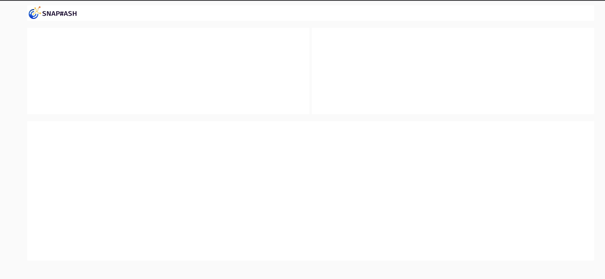

# Static UI 
Example layout that `static-ui.json` flow file contains. 

Open SnapHash editor `https://<youinstance-id>.snaphash.io/edit` -> Menu `Import` -> `Select a file to Import`. Once imported, press `Deploy`. If all goes well, you can access the UI at `https://<youinstance-id>.snaphash.io/edit`. 

Feel free to modify more panels based on this template.

